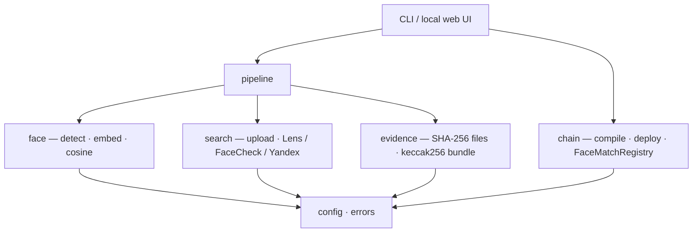
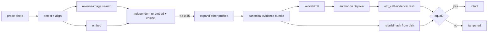
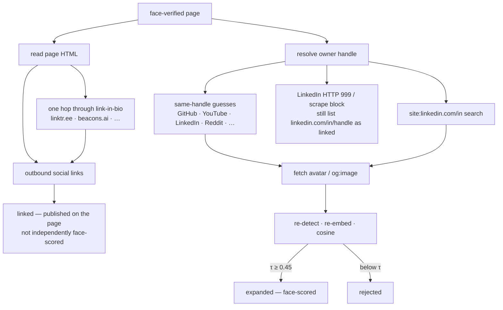

# FaceChain

HH Goa 2026 — Shortlisting Task 3.

A probe photo is face-detected and embedded, reverse-image-searched on public social media, then independently re-scored. Surviving evidence is hashed and anchored on-chain so a later check can prove the files have not changed.

Search proposes candidates. The face model decides. The chain timestamps a hash — it does not prove the match is true.

---

## 1. What it does

1. **Detect** the strongest face (SCRFD) and align it to 112×112.
2. **Embed** a 512-d ArcFace vector (`w600k_r50`), L2-normalised.
3. **Search** the aligned crop (Google Lens by default; FaceCheck or Yandex as fallbacks). Hits are filtered to social domains.
4. **Verify** every candidate independently: re-detect, re-embed, cosine vs the probe. Below τ = 0.45 → reject. The provider score is metadata only.
5. **Bundle** `probe.jpg`, `candidate.jpg`, `post_text.txt` into canonical JSON → keccak256.
6. **Anchor** that hash on `FaceMatchRegistry` (append-only).
7. **Re-verify** by reading the on-chain hash and recomputing from local files.

The embedding is load-bearing at both ends: the query is the face crop, and every returned image is re-scored. Without step 4 this is ordinary image search.

---

## 2. Architecture

**Figure 1.** Layered system. Dependencies point downward only. `config` is the only module that reads the environment.



**Figure 2.** End-to-end flow. After a face-verified page, other socials are pulled from that one profile (see Figure 3). Verification never trusts a stored digest and never re-fetches hosted URLs.



### Profile expansion — one verified page → other socials

Reviewer feedback: reverse-image search usually verifies **one** post or portfolio. Other Lens hits (LinkedIn avatars, GitHub tiles) are often a different person and fail cosine. Dropping them is correct, but it looks like the pipeline “only found Instagram.” The accounts that person actually claims are usually **on the page that passed**, or they reuse the same handle.

We never invent a handle from an Instagram `/p/…` shortcode. The owner is taken only from the URL shape, the provider title/source, Google’s own snippet for that post, or Instagram oEmbed.

**Figure 3.** Two tracks from a single face-verified page. `linked` is a claim on that page. `expanded` still has to clear τ.



LinkedIn often returns HTTP 999 to scrapers. That must not erase a real match: the verified URL stays, and `linkedin.com/in/{handle}` is kept as a **linked** claim when the avatar cannot be scored.

---

## 3. How to run

Python 3.11 and [uv](https://github.com/astral-sh/uv). First run downloads ~300 MB of InsightFace models to `~/.insightface`.

On Windows use `uv run --no-sync` (the lockfile pulls `safe-pysha3`, which has no Windows wheel).

```bash
uv venv --python 3.11
uv pip install -e ".[dev]"
cp .env.example .env
```

Fill `.env`:

| Variable | Needed for |
|---|---|
| `SERPAPI_KEY` | Google Lens (SerpAPI) |
| `IMGBB_KEY` | public hop so Lens can fetch the crop |
| `FACECHECK_KEY` | optional; `FACECHECK_DEMO=1` spends no credits |
| `RPC_URL` | Sepolia / Base Sepolia |
| `PRIVATE_KEY` | CLI deploy / CLI `run` on a public net (throwaway faucet wallet) |
| `CONTRACT_ADDRESS` | already-deployed registry |
| `NETWORK` | `local` · `sepolia` · `base-sepolia` |

```bash
# offline — no keys
uv run --no-sync pytest -q
uv run --no-sync facechain selftest \
  --probe tests/fixtures/faces_multi.jpg \
  --candidate tests/fixtures/faces_multi.jpg \
  --post-url "https://example.com/post/1"

# detect only
uv run --no-sync facechain scan --image photo.jpg

# search + face-verify, no chain
uv run --no-sync facechain search --image photo.jpg

# full pipeline (local in-process chain)
uv run --no-sync facechain run --image photo.jpg --network local

# public testnet — set NETWORK / RPC_URL / CONTRACT_ADDRESS first
uv run --no-sync facechain run --image photo.jpg --network sepolia
uv run --no-sync facechain verify --record-id 0 --run-dir artifacts/run-… --network sepolia

# local UI (same pipeline; MetaMask signs Sepolia txs)
uv run --no-sync facechain serve    # http://127.0.0.1:8000
```

`selftest` skips search only: you supply the candidate. Detection, cosine, hashing, anchor, and the on-chain read are real. `--network local` is in-process `eth-tester` and does not persist between CLI invocations, so `run` then `verify` as two commands needs `sepolia` or `base-sepolia`.

| Exit | Meaning |
|---|---|
| 0 | success (`verify --tamper` also exits 0) |
| 1 | verification mismatch |
| 2 | no face |
| 3 | search provider error |
| 4 | no candidate above threshold |
| 5 | chain error |

---

## 4. Blockchain

**Ethereum Sepolia** (chain id 11155111) is the public demo network. `base-sepolia` is supported. `local` is `eth-tester` for tests.

The contract is Solidity 0.8.24, compiled with `py-solc-x` (no Foundry / Hardhat). `FaceMatchRegistry` is append-only: no update, no delete, no owner, no upgrade.

Each record stores:

- `evidenceHash` — keccak256 of the canonical bundle
- `postUrl` — cleartext, so a reviewer can open the tx and read the matched post
- `similarityBps` — cosine × 10 000 (10 000 = cosine 1.0, **not** “100% sure”)
- `timestamp`, `submitter`

The chain proves *when* a claim was recorded and that the hash has not changed. Anchoring a wrong match produces a permanent record of a wrong match.

---

## 5. Known limitations

- **Google Lens is not a face search.** A photo that has never been indexed will not match, even if the person is online. FaceCheck searches faces; it is paid (`FACECHECK_DEMO=1` by default).
- **A match is evidence, not identification.** Cosine above τ is a ranked hypothesis.
- **τ = 0.45 is uncalibrated** — a conventional ArcFace operating point, not a labelled evaluation.
- **Accuracy degrades** with pose, lighting, age, occlusion, and across demographic groups.
- **No match ≠ the person is not online.** Search only sees publicly indexed pages.
- **`post_text.txt` is provider metadata** (URL, title, source), not scraped post body.
- **Yandex** is best-effort markup scraping; a bot wall raises an error instead of an empty result.
- **Linked profiles are claims, not face matches.** Outbound links and a blocked LinkedIn URL are listed separately from cosine-scored expansions.
- **Embeddings stay off-chain.** The bundle stores a digest of the vector, never the vector. Artifacts are local and git-ignored.

---

```
src/facechain/
├── pipeline.py     # verify_candidates is the core claim
├── evidence.py     # canonical JSON + hashing
├── verify.py       # on-chain read vs local recompute
├── face/           # detect, embed, cosine
├── search/         # Lens, FaceCheck, Yandex, page_links, permalink
├── profiles.py     # collapse posts → accounts; face vs linked origin
├── chain/          # compile, deploy, registry
├── config.py       # only module that reads os.environ
└── cli.py
```
